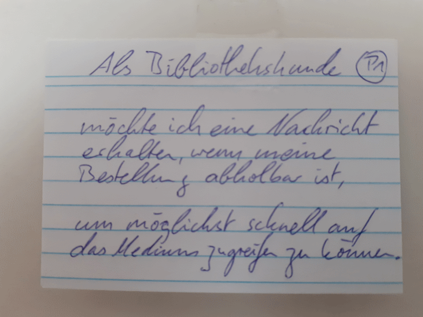
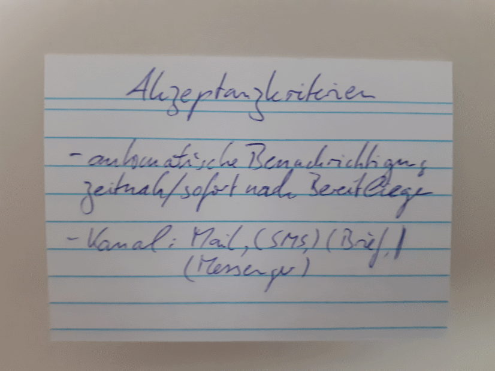
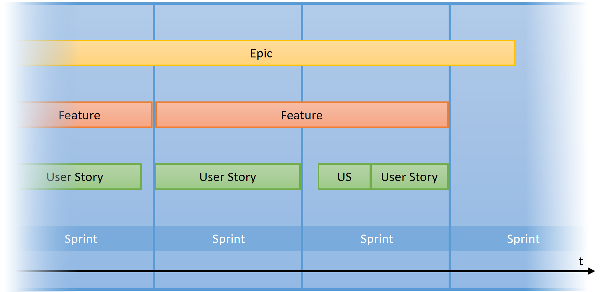

# Anforderungen mit User stories festhalten und organisieren

## Was ist eine User Story?

## Was ist eine User Story? (2)

## User Stories als Teil agiler Softwareentwicklung

## Eigenschaften einer User Story

> **Als** _Rolle_ **möchte ich** _Ziel_ **, um** _Nutzen/Zweck_ **.**

- feste Satzstruktur
- wichtige Fragen klären: Wer? Was? Warum?
- keine Fachsprache
- überschaubarer Umfang
- **Raum für Interpretation** (bei der Umsetzung)

=> "A user story is a promise for a conversation."

## INVEST-Prinzipien

- Independent
- Negotiable
- Valuable
- Estimable
- Small
- Testable

## Abgrenzung zu Usecases

Use Cases und User Stories werden in Nutzersprache verfasst.

Use Cases sind umfangreicher als User stories.
Use Cases beschreiben einen kompletten Workflow, User stories einzelne Aspekte/Schritte.

## Software-Werkzeuge

- User Story Mapping, Kanban-Boards
- Jira, Asana, Trello, ...
- GitLab / GitHub
  - Umsetzung über Issues möglich < wird hier gezeigt

## Einsatz von User Stories

Pragmatisch: viele Varianten

Arbeits- / Projektorganisation

=> Über Softwareentwicklung hinaus nutzbar?

## User Stories und DH

- Wo können User Stories sinnvoll eingesetzt werden?
	- Software-Entwicklung?
	- Forschung?
	- Lehre?

- Gibt es eigene Erfahrung?

## User Stories und DH: Ideen

- Projektmanagement
- eigene Fortschritts- , Zeit- und Ressourcenplanung
- Erfassung von Anforderngen dritter (s. Kartenatlas/Ingo Frank)
- Kommunikation bei stud. Arbeiten
  - mit BetreuerInnen
  - mit AnwenderInnen
  - mit KorrekturleserInnen
  

